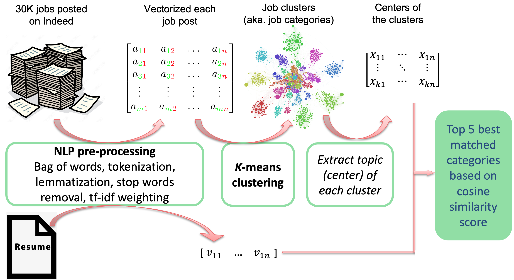

---

author: Ying Yu  
Date:   09/20/2023

---

## Project title

**Resume-based career explorer**

* This is Ying Yu's capstone project done at The Data Incubator Spring 2023 cohort.
* The project was selected as one of the 10 projects in the final showcase. The showcase presentation slides can be found in `.../capstone_showcase_YingYu.pptx` 

## Problem statement

* Changing careers can be a daunting task. The common way to explore career options is to search online. You enter a few keywords to the search bar and then start to manually pick the relevant information from thousands of webpages it returns. This is painfully time-consuming and takes enormous patience. What’s worse, the information you spend days even months collecting is not tailored for you. 
* This project will save you from this pain. It automates the career exploring process for you. You upload your resume, then it will tell you the types of careers you can take.

## Project

* The dataset I used contains 30002 job postings that were posted on Indeed in 2019, downloaded from Kaggle. The dataset is originally in .csv format, one row per job posting with 30 columns. The column named “Job Description” contains the most comprehensive information including job responsibilities, requirements, benefits, etc. Each entry of this column is in html format. BeautifulSoup was used in order to extract contents from these html entries. 

* The “Job Description” of each posting was then turned into a numeric vector using the bag-of-words model, resulting in a matrix where each row is a job post, and each column is a feature. Then Then k-means clustering was used to group them into 36 clusters, which represents 36 job categories. The center of each cluster was used to represent the topic of that job category.

* Once a user uploads his or her resume to this career explorer, this resume will be transformed into a vector using the same NLP transformer as the one used for transforming the job postings. The this resume vector will be compared with the centroid vectors of job categories using cosine similarity. The top 5 best matched job categories will be returned to the user.

* Below is a flowchart illustrating this process:

	
